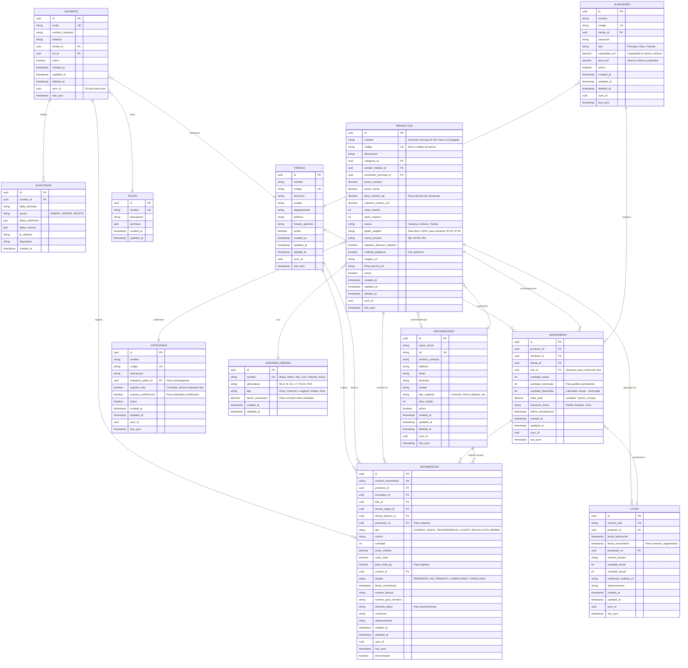

# Flutter Management System

Sistema de gestión de productos para materiales de construcción con sincronización offline-first y backend en Supabase.

## 📋 Tabla de Contenidos

- [Descripción](#descripción)
- [Características](#características)
- [Requisitos Previos](#requisitos-previos)
- [Instalación](#instalación)
- [Configuración de Supabase](#configuración-de-supabase)
- [Variables de Entorno](#variables-de-entorno)
- [Comandos Útiles](#comandos-útiles)
- [Estructura del Proyecto](#estructura-del-proyecto)
- [Testing](#testing)
- [Seguridad](#seguridad)
- [Troubleshooting](#troubleshooting)

## 📝 Descripción

Sistema de gestión empresarial para control de inventarios, productos, proveedores y movimientos de almacén. Utiliza arquitectura Clean Architecture con patrón BLoC y capacidades offline-first mediante SQLite local sincronizado con Supabase.

## ✨ Características

- 🔄 Sincronización offline-first con Supabase
- 📦 Gestión de productos, inventarios y almacenes
- 👥 Control de usuarios con roles y permisos
- 🏪 Múltiples tiendas y proveedores
- 📊 Seguimiento de movimientos de inventario
- 🔐 Autenticación segura con RLS (Row Level Security)
- 🎨 Tema personalizado y UI moderna
- 📱 Multiplataforma (iOS, Android)

## Diagrama Entidad-Relación



## 📦 Requisitos Previos

- Flutter SDK (>=3.0.0)
- Dart SDK (>=3.0.0)
- Cuenta en [Supabase](https://supabase.com)
- IDE: VS Code o Android Studio

## 🚀 Instalación

```bash
# Clonar el repositorio
git clone https://github.com/tu-usuario/flutter_management_system.git
cd flutter_management_system

# Instalar dependencias
flutter pub get

# Generar código de Drift
flutter pub run build_runner build --delete-conflicting-outputs
```

## Archivos SQL para Supabase

### 1. Schema Principal: `supabase_schema_complete.sql`
Contiene el esquema completo de la base de datos:
- 12 tablas con relaciones y constraints
- Campos de sincronización (sync_id, last_sync, sincronizado)
- Triggers para auto-actualización de timestamps
- Índices para optimización de consultas
- Vistas para consultas complejas (vw_inventario_completo, vw_movimientos_completos, vw_productos_stock_bajo)
- Funciones RPC (get_dashboard_stats)
- Datos semilla (roles, unidades de medida, categorías)

**Deployment:** Copiar y pegar el contenido completo en el SQL Editor de Supabase.

### 2. Políticas de Seguridad: `supabase_rls_policies.sql`
Contiene las políticas de seguridad a nivel de fila (RLS) que protegen los datos:
- Habilita RLS en todas las tablas
- Funciones helper (get_user_tienda_id, is_admin, is_manager, user_has_role)
- Políticas por tabla con permisos basados en roles
- Restricciones por tienda para acceso multi-tenant
- Control de operaciones CRUD según permisos de usuario

**Deployment:** Ejecutar DESPUÉS de `supabase_schema_complete.sql`

> **Nota:** El contenido completo de las RLS policies se encuentra en el archivo `supabase_rls_policies.sql` del proyecto. A continuación se muestra un resumen de las políticas principales:

```sql
-- ============================================
-- RESUMEN DE POLÍTICAS RLS
-- (Ver supabase_rls_policies.sql para el código completo)
-- ============================================

-- 1. FUNCIONES HELPER
--    - get_user_tienda_id(): Obtiene la tienda del usuario autenticado
--    - user_has_role(role_name): Verifica si el usuario tiene un rol específico
--    - is_admin(): Verifica si el usuario es administrador
--    - is_manager(): Verifica si el usuario es gerente o admin

-- 2. POLÍTICAS POR TABLA
--    roles: Lectura para todos, modificación solo admin
--    tiendas: Lectura para todos, gestión solo admin
--    usuarios: Lectura propia + tienda, creación solo admin, actualización propia
--    almacenes: Lectura y gestión por tienda, solo gerentes
--    categorias: Lectura para todos, gestión solo admin
--    unidades_medida: Lectura para todos, gestión solo admin
--    proveedores: Lectura para todos, gestión solo gerentes
--    productos: Lectura para todos, gestión solo gerentes
--    lotes: Lectura para todos, gestión solo gerentes
--    inventarios: Lectura y gestión por tienda
--    movimientos: Lectura y creación por tienda, gestión solo admin
--    auditorias: Solo admin puede leer, sistema puede insertar

-- 3. VERIFICACIÓN
SELECT schemaname, tablename, policyname, cmd
FROM pg_policies 
WHERE schemaname = 'public'
ORDER BY tablename;
```

## ⚙️ Configuración de Supabase

### Paso 1: Crear Proyecto en Supabase

1. Ve a [https://supabase.com](https://supabase.com)
2. Crea una cuenta o inicia sesión
3. Crea un nuevo proyecto
4. Anota tu **URL** y **ANON KEY** (en Settings > API)

### Paso 2: Ejecutar el Schema SQL

1. Ve a **SQL Editor** en Supabase Dashboard
2. Copia y pega el contenido completo de `supabase_schema_complete.sql`
3. Ejecuta el script (puede tardar unos segundos)
4. Luego copia y pega el contenido de `supabase_rls_policies.sql`
5. Ejecuta las políticas RLS

### Paso 3: Configurar Autenticación

1. Ve a **Authentication > Settings** en Supabase
2. Habilita **Email authentication**
3. Configura **Site URL**: `http://localhost:3000` (desarrollo)
4. Configura **Redirect URLs** para producción

### Paso 4: Configurar Storage (Opcional)

Para habilitar imágenes de productos:

1. Ve a **Storage** en Supabase
2. Crea un bucket llamado `productos-images`
3. Ejecuta estas políticas SQL:

```sql
-- Permitir lectura pública de imágenes
CREATE POLICY "Las imágenes de productos son públicas"
ON storage.objects FOR SELECT
USING (bucket_id = 'productos-images');

-- Permitir subida de imágenes autenticadas
CREATE POLICY "Usuarios autenticados pueden subir imágenes"
ON storage.objects FOR INSERT
WITH CHECK (
  bucket_id = 'productos-images' 
  AND auth.role() = 'authenticated'
);

-- Permitir actualización de imágenes
CREATE POLICY "Usuarios autenticados pueden actualizar imágenes"
ON storage.objects FOR UPDATE
USING (
  bucket_id = 'productos-images' 
  AND auth.role() = 'authenticated'
);
```

### Paso 5: Crear Usuario Admin Inicial

1. Ve a **Authentication > Users** en Supabase
2. Crea un usuario manualmente (ejemplo: `admin@tuempresa.com`)
3. Ejecuta este SQL para asignar rol de admin:

```sql
INSERT INTO public.usuarios (
  email, 
  nombre_completo, 
  rol_id, 
  auth_user_id, 
  activo
) VALUES (
  'admin@tuempresa.com',
  'Administrador del Sistema',
  '00000000-0000-0000-0000-000000000001', -- ID del rol Administrador
  'UUID-DEL-USUARIO-AUTH', -- Copiar del panel de Authentication
  true
);
```

### Paso 6: Probar la Conexión

1. Ejecuta tu app Flutter
2. Intenta hacer login con el usuario admin
3. Verifica que puedes crear/leer datos

## 🔐 Variables de Entorno

### Archivo `.env.example`

```bash
# Supabase Configuration
SUPABASE_URL=https://tu-proyecto.supabase.co
SUPABASE_ANON_KEY=tu-anon-key-muy-larga-aqui

# Debug Mode
DEBUG_MODE=true
```

### Configuración

1. Copia `.env.example` como `.env`
2. Completa con tus credenciales de Supabase
3. **NUNCA** subas el archivo `.env` a Git

### Agregar a `.gitignore`

```
# Environment files
.env
.env.local
.env.*.local
```

### Ejecutar con Variables de Entorno

```bash
# Desarrollo (usando valores del .env)
flutter run --dart-define-from-file=.env

# Producción
flutter build apk --dart-define=SUPABASE_URL=tu-url --dart-define=SUPABASE_ANON_KEY=tu-key
```

## 🛠️ Comandos Útiles

### Desarrollo

```bash
# Instalar dependencias
flutter pub get

# Generar código de Drift
flutter pub run build_runner build --delete-conflicting-outputs

# Generar código en modo watch (desarrollo continuo)
flutter pub run build_runner watch --delete-conflicting-outputs

# Limpiar y regenerar todo
flutter clean
flutter pub get
flutter pub run build_runner build --delete-conflicting-outputs

# Ejecutar app con variables de entorno
flutter run --dart-define-from-file=.env
```

### Build

```bash
# Android APK
flutter build apk --dart-define-from-file=.env

# Android App Bundle
flutter build appbundle --dart-define-from-file=.env

# iOS
flutter build ios --dart-define-from-file=.env
```

## 📁 Estructura del Proyecto

```
lib/
├── core/
│   ├── config/
│   │   ├── app_config.dart
│   │   ├── env_config.dart
│   │   └── supabase_config.dart
│   ├── constants/
│   │   ├── app_constants.dart
│   │   ├── database_constants.dart
│   │   └── sync_constants.dart
│   ├── errors/
│   │   ├── exceptions.dart
│   │   └── failures.dart
│   ├── network/
│   │   ├── network_info.dart
│   │   └── connectivity_observer.dart
│   ├── sync/
│   │   ├── extensions/
│   │   │   └── sync_extensions.dart
│   │   ├── sync_manager.dart
│   │   ├── sync_queue.dart
│   │   ├── conflict_resolver.dart
│   │   ├── sync_item.dart
│   │   ├── sync_service.dart
│   │   ├── sync.logger.dart
│   │   ├── sync.service.dart
│   │   ├── README.md
│   │   └── sync_status.dart
│   ├── utils/
│   │   ├── date_utils.dart
│   │   ├── uuid_generator.dart
│   │   ├── validators.dart
│   │   └── logger.dart
│   └── theme/
│       ├── app_theme.dart
│       ├── app_colors.dart
│       └── app_text_styles.dart
│
├── data/
│   ├── datasources/
│   │   ├── local/
│   │   │   ├── database/
│   │   │   │   ├── app_database.dart              # Drift database
│   │   │   │   ├── app_database.g.dart            # Generated
│   │   │   │   ├── daos/
│   │   │   │   │   ├── usuario_dao.dart
│   │   │   │   │   ├── producto_dao.dart
│   │   │   │   │   ├── inventario_dao.dart
│   │   │   │   │   ├── movimiento_dao.dart
│   │   │   │   │   ├── tienda_dao.dart
│   │   │   │   │   ├── almacen_dao.dart
│   │   │   │   │   ├── proveedor_dao.dart
│   │   │   │   │   ├── lote_dao.dart
│   │   │   │   │   └── categoria_dao.dart
│   │   │   │   └── tables/
│   │   │   │       ├── usuarios_table.dart
│   │   │   │       ├── productos_table.dart
│   │   │   │       ├── inventarios_table.dart
│   │   │   │       ├── movimientos_table.dart
│   │   │   │       ├── tiendas_table.dart
│   │   │   │       ├── almacenes_table.dart
│   │   │   │       ├── proveedores_table.dart
│   │   │   │       ├── lotes_table.dart
│   │   │   │       ├── categorias_table.dart
│   │   │   │       ├── roles_table.dart
│   │   │   │       ├── unidades_medida_table.dart
│   │   │   │       └── auditorias_table.dart
│   │   │   └── storage/
│   │   │       └── hydrated_storage_service.dart
│   │   └── remote/
│   │       ├── supabase_datasource.dart
│   │       ├── auth_remote_datasource.dart
│   │       ├── producto_remote_datasource.dart
│   │       ├── inventario_remote_datasource.dart
│   │       ├── movimiento_remote_datasource.dart
│   │       ├── tienda_remote_datasource.dart
│   │       ├── almacen_remote_datasource.dart
│   │       ├── proveedor_remote_datasource.dart
│   │       └── sync_remote_datasource.dart
│   │
│   ├── models/
│   │   ├── usuario_model.dart
│   │   ├── producto_model.dart
│   │   ├── inventario_model.dart
│   │   ├── movimiento_model.dart
│   │   ├── tienda_model.dart
│   │   ├── almacen_model.dart
│   │   ├── proveedor_model.dart
│   │   ├── lote_model.dart
│   │   ├── categoria_model.dart
│   │   └── sync_status_model.dart
│   │
│   └── repositories/
│       ├── auth_repository_impl.dart
│       ├── usuario_repository_impl.dart
│       ├── producto_repository_impl.dart
│       ├── inventario_repository_impl.dart
│       ├── movimiento_repository_impl.dart
│       ├── tienda_repository_impl.dart
│       ├── almacen_repository_impl.dart
│       ├── proveedor_repository_impl.dart
│       ├── lote_repository_impl.dart
│       ├── categoria_repository_impl.dart
│       └── sync_repository_impl.dart
│
├── domain/
│   ├── entities/
│   │   ├── usuario.dart
│   │   ├── producto.dart
│   │   ├── inventario.dart
│   │   ├── movimiento.dart
│   │   ├── tienda.dart
│   │   ├── almacen.dart
│   │   ├── proveedor.dart
│   │   ├── lote.dart
│   │   └── categoria.dart
│   │
│   ├── repositories/
│   │   ├── auth_repository.dart
│   │   ├── usuario_repository.dart
│   │   ├── producto_repository.dart
│   │   ├── inventario_repository.dart
│   │   ├── movimiento_repository.dart
│   │   ├── tienda_repository.dart
│   │   ├── almacen_repository.dart
│   │   ├── proveedor_repository.dart
│   │   ├── lote_repository.dart
│   │   ├── categoria_repository.dart
│   │   └── sync_repository.dart
│   │
│   └── usecases/
│       ├── auth/
│       │   ├── auth_usecases.dart
│       │   ├── get_current_user_usecase.dart
│       │   ├── is_authenticated_usecase.dart
│       │   ├── login_usecase.dart
│       │   ├── logout_usecase.dart
│       │   ├── refresh_token_usecase.dart
|       |   ├── register_usecase.dart
|       |   ├── reset_password_usecase.dart
│       │   └── update_password_usecase.dart
│       ├── productos/
│       │   ├── get_productos_usecase.dart
│       │   ├── create_producto_usecase.dart
│       │   ├── update_producto_usecase.dart
│       │   ├── delete_producto_usecase.dart
│       │   └── search_productos_usecase.dart
│       ├── inventarios/
│       │   ├── get_inventario_usecase.dart
│       │   ├── update_stock_usecase.dart
│       │   └── check_stock_minimo_usecase.dart
│       ├── movimientos/
│       │   ├── create_movimiento_usecase.dart
│       │   ├── get_movimientos_usecase.dart
│       │   ├── cancel_movimiento_usecase.dart
│       │   └── complete_movimiento_usecase.dart
│       └── sync/
│           ├── sync_all_usecase.dart
│           ├── sync_entity_usecase.dart
│           └── resolve_conflicts_usecase.dart
│
├── presentation/
│   ├── blocs/
│   │   ├── auth/
│   │   │   ├── auth_bloc.dart
│   │   │   ├── auth_event.dart
│   │   │   └── auth_state.dart
│   │   ├── productos/
│   │   │   ├── producto_bloc.dart
│   │   │   ├── producto_event.dart
│   │   │   └── producto_state.dart
│   │   ├── inventarios/
│   │   │   ├── inventario_bloc.dart
│   │   │   ├── inventario_event.dart
│   │   │   └── inventario_state.dart
│   │   ├── movimientos/
│   │   │   ├── movimiento_bloc.dart
│   │   │   ├── movimiento_event.dart
│   │   │   └── movimiento_state.dart
│   │   ├── tiendas/
│   │   │   ├── tienda_bloc.dart
│   │   │   ├── tienda_event.dart
│   │   │   └── tienda_state.dart
│   │   ├── almacenes/
│   │   │   ├── almacen_bloc.dart
│   │   │   ├── almacen_event.dart
│   │   │   └── almacen_state.dart
│   │   ├── proveedores/
│   │   │   ├── proveedor_bloc.dart
│   │   │   ├── proveedor_event.dart
│   │   │   └── proveedor_state.dart
│   │   └── sync/
│   │       ├── sync_bloc.dart
│   │       ├── sync_event.dart
│   │       └── sync_state.dart
│   │
│   ├── pages/
│   │   ├── auth/
│   │   │   ├── login_page.dart
│   │   │   └── register_page.dart
│   │   ├── home/
│   │   │   ├── home_page.dart
│   │   │   └── dashboard_page.dart
│   │   ├── productos/
│   │   │   ├── productos_list_page.dart
│   │   │   ├── producto_detail_page.dart
│   │   │   └── producto_form_page.dart
│   │   ├── inventarios/
│   │   │   ├── inventarios_list_page.dart
│   │   │   ├── inventario_detail_page.dart
│   │   │   └── ajuste_inventario_page.dart
│   │   ├── movimientos/
│   │   │   ├── movimientos_list_page.dart
│   │   │   ├── movimiento_detail_page.dart
│   │   │   ├── crear_entrada_page.dart
│   │   │   ├── crear_salida_page.dart
│   │   │   └── crear_transferencia_page.dart
│   │   ├── tiendas/
│   │   │   ├── tiendas_list_page.dart
│   │   │   ├── tienda_detail_page.dart
│   │   │   └── tienda_form_page.dart
│   │   ├── almacenes/
│   │   │   ├── almacenes_list_page.dart
│   │   │   ├── almacen_detail_page.dart
│   │   │   └── almacen_form_page.dart
│   │   ├── proveedores/
│   │   │   ├── proveedores_list_page.dart
│   │   │   ├── proveedor_detail_page.dart
│   │   │   └── proveedor_form_page.dart
│   │   ├── reportes/
│   │   │   ├── reportes_page.dart
│   │   │   ├── reporte_inventario_page.dart
│   │   │   └── reporte_movimientos_page.dart
│   │   └── settings/
│   │       ├── settings_page.dart
│   │       └── sync_settings_page.dart
│   │
│   └── widgets/
│       ├── common/
│       │   ├── custom_app_bar.dart
│       │   ├── custom_button.dart
│       │   ├── custom_text_field.dart
│       │   ├── loading_indicator.dart
│       │   ├── error_widget.dart
│       │   ├── empty_state_widget.dart
│       │   └── sync_indicator.dart
│       ├── productos/
│       │   ├── producto_card.dart
│       │   ├── producto_list_item.dart
│       │   └── producto_search_bar.dart
│       ├── inventarios/
│       │   ├── inventario_card.dart
│       │   ├── stock_level_indicator.dart
│       │   └── inventario_chart.dart
│       └── movimientos/
│           ├── movimiento_card.dart
│           ├── movimiento_timeline.dart
│           └── movimiento_status_badge.dart
│
├── routes/
│   ├── app_router.dart
│   └── route_names.dart
│
└── main.dart

test/
├── core/
│   └── sync/
│       └── sync_manager_test.dart
├── data/
│   ├── datasources/
│   │   └── local/
│   │       └── database/
│   │           └── daos/
│   │               ├── producto_dao_test.dart
│   │               └── movimiento_dao_test.dart
│   └── repositories/
│       ├── producto_repository_impl_test.dart
│       └── sync_repository_impl_test.dart
├── domain/
│   └── usecases/
│       ├── productos/
│       │   └── get_productos_usecase_test.dart
│       └── sync/
│           └── sync_all_usecase_test.dart
└── presentation/
    └── blocs/
        ├── auth/
        │   └── auth_bloc_test.dart
        ├── productos/
        │   └── producto_bloc_test.dart
        └── sync/
            └── sync_bloc_test.dart
```

## 🔄 Configuración de Realtime (Opcional)

Para habilitar actualizaciones en tiempo real:

### 1. Habilitar Replicación en Supabase

1. Ve a **Database > Replication**
2. Habilita replicación para las tablas: `productos`, `inventarios`, `movimientos`

### 2. Implementación en Flutter

```dart
final channel = supabase
  .channel('public:productos')
  .onPostgresChanges(
    event: PostgresChangeEvent.all,
    schema: 'public',
    table: 'productos',
    callback: (payload) {
      print('Cambio detectado: ${payload.newRecord}');
    },
  )
  .subscribe();
```

## 🧪 Testing

### Verificar Base de Datos

```sql
-- Verificar roles
SELECT * FROM public.roles;

-- Verificar categorías
SELECT * FROM public.categorias;

-- Verificar unidades de medida
SELECT * FROM public.unidades_medida;

-- Verificar que RLS está habilitado
SELECT tablename, rowsecurity 
FROM pg_tables 
WHERE schemaname = 'public' 
AND rowsecurity = true;

-- Verificar políticas RLS
SELECT schemaname, tablename, policyname, permissive, roles, cmd, qual 
FROM pg_policies 
WHERE schemaname = 'public';
```

## 💾 Backup y Restore

### Hacer Backup

1. En Supabase Dashboard: **Database > Backups**
2. O usar `pg_dump` si tienes acceso directo a la base de datos

### Restore

1. Supabase Dashboard: **SQL Editor**
2. Pegar tu backup SQL y ejecutar

## 📊 Monitoring y Logs

Ver logs en tiempo real:

- **Postgres Logs**: Supabase Dashboard > Logs > Postgres Logs
- **API Logs**: Supabase Dashboard > Logs > API Logs

## 🔒 Seguridad

### Checklist

- ✅ RLS habilitado en todas las tablas
- ✅ Políticas RLS configuradas correctamente
- ✅ Variables de entorno no commiteadas (`.env` en `.gitignore`)
- ✅ `ANON_KEY` es pública, `SERVICE_KEY` es privada (no usar en frontend)
- ✅ Auth configurada con PKCE flow
- ✅ Validaciones en el backend (triggers y funciones)
- ✅ Auditoría habilitada en tablas críticas

## 🐛 Troubleshooting

### Error: "relation does not exist"

**Solución**: Verificar que ejecutaste todo el schema SQL en Supabase.

### Error: "permission denied for table"

**Solución**: Revisar políticas RLS, puede que falte una policy.

### Error: "JWT expired"

**Solución**: El token expiró, implementar refresh automático en la app.

### Error: "row level security policy violation"

**Solución**: El usuario no tiene permisos según las políticas RLS definidas.

### No se sincronizan cambios en realtime

**Solución**: Habilitar replicación en Database > Replication para las tablas necesarias.

### Errores de compilación en DAOs

**Solución**: Ejecutar `flutter pub run build_runner build --delete-conflicting-outputs` para regenerar archivos `.g.dart`.

## 📚 Recursos

- [Documentación de Flutter](https://docs.flutter.dev/)
- [Documentación de Drift](https://drift.simonbinder.eu/)
- [Documentación de Supabase](https://supabase.com/docs)
- [Patrón BLoC](https://bloclibrary.dev/)

## 📄 Licencia

Este proyecto es privado y confidencial.

## 👥 Contribución

Para contribuir al proyecto, contactar al equipo de desarrollo.

