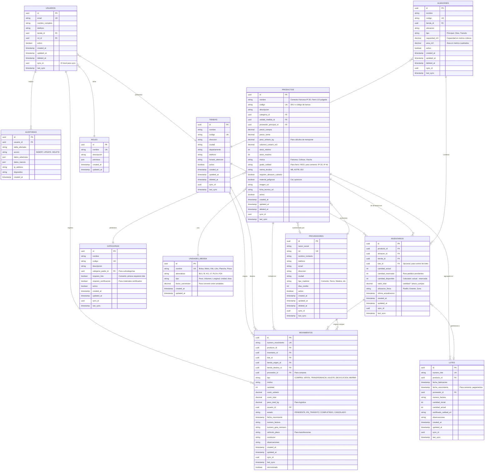

# Flutter Management System

Sistema de gestión de productos para materiales de construcción con sincronización offline-first y backend en NestJS.

## 📋 Tabla de Contenidos

- [Descripción](#descripción)
- [Características](#características)
- [Requisitos Previos](#requisitos-previos)
- [Instalación](#instalación)
- [Configuración del Backend](#configuración-del-backend)
- [Variables de Entorno](#variables-de-entorno)
- [Comandos Útiles](#comandos-útiles)
- [Estructura del Proyecto](#estructura-del-proyecto)
- [Testing](#testing)
- [Seguridad](#seguridad)
- [Troubleshooting](#troubleshooting)

## 📝 Descripción

Sistema de gestión empresarial para control de inventarios, productos, proveedores y movimientos de almacén. Utiliza arquitectura Clean Architecture con patrón BLoC y capacidades offline-first mediante SQLite local sincronizado con backend NestJS.

## ✨ Características

- 🔄 Sincronización offline-first con NestJS REST API
- 📦 Gestión de productos, inventarios y almacenes
- 👥 Control de usuarios con roles y permisos
- 🏪 Múltiples tiendas y proveedores
- 📊 Seguimiento de movimientos de inventario
- 🔐 Autenticación JWT con MFA (Multi-Factor Authentication)
- 🎨 Tema personalizado y UI moderna
- 📱 Multiplataforma (iOS, Android)

## Diagrama Entidad-Relación


```mermaid
erDiagram
    USUARIOS ||--o{ MOVIMIENTOS : registra
    USUARIOS ||--o{ AUDITORIAS : realiza
    USUARIOS }o--|| TIENDAS : pertenece
    USUARIOS }o--|| ROLES : tiene
    
    TIENDAS ||--o{ INVENTARIOS : tiene
    TIENDAS ||--o{ MOVIMIENTOS : origina
    TIENDAS ||--o{ MOVIMIENTOS : destino
    
    PRODUCTOS ||--o{ INVENTARIOS : "se almacena en"
    PRODUCTOS }o--|| CATEGORIAS : pertenece
    PRODUCTOS }o--|| UNIDADES_MEDIDA : usa
    PRODUCTOS ||--o{ MOVIMIENTOS : "incluido en"
    PRODUCTOS }o--o| PROVEEDORES : "suministrado por"
    PRODUCTOS ||--o{ LOTES : "agrupado en"
    
    ALMACENES ||--o{ INVENTARIOS : contiene
    ALMACENES }o--|| TIENDAS : "ubicado en"
    
    INVENTARIOS ||--o{ MOVIMIENTOS : afecta
    INVENTARIOS }o--o| LOTES : "pertenece a"
    
    PROVEEDORES ||--o{ PRODUCTOS : suministra
    PROVEEDORES ||--o{ MOVIMIENTOS : "origina compra"
    
    USUARIOS {
        uuid id PK
        string email UK
        string nombre_completo
        string telefono
        uuid tienda_id FK
        uuid rol_id FK
        boolean activo
        timestamp created_at
        timestamp updated_at
        timestamp deleted_at
        uuid sync_id "ID local para sync"
        timestamp last_sync
    }
    
    ROLES {
        uuid id PK
        string nombre UK
        string descripcion
        json permisos
        timestamp created_at
        timestamp updated_at
    }
    
    TIENDAS {
        uuid id PK
        string nombre
        string codigo UK
        string direccion
        string ciudad
        string departamento
        string telefono
        string horario_atencion
        boolean activo
        timestamp created_at
        timestamp updated_at
        timestamp deleted_at
        uuid sync_id
        timestamp last_sync
    }
    
    ALMACENES {
        uuid id PK
        string nombre
        string codigo UK
        uuid tienda_id FK
        string ubicacion
        string tipo "Principal, Obra, Transito"
        decimal capacidad_m3 "Capacidad en metros cúbicos"
        decimal area_m2 "Área en metros cuadrados"
        boolean activo
        timestamp created_at
        timestamp updated_at
        timestamp deleted_at
        uuid sync_id
        timestamp last_sync
    }
    
    CATEGORIAS {
        uuid id PK
        string nombre
        string codigo UK
        string descripcion
        uuid categoria_padre_id FK "Para subcategorías"
        boolean requiere_lote "Cemento, pintura requieren lote"
        boolean requiere_certificacion "Para materiales certificados"
        boolean activo
        timestamp created_at
        timestamp updated_at
        uuid sync_id
        timestamp last_sync
    }
    
    UNIDADES_MEDIDA {
        uuid id PK
        string nombre UK "Bolsa, Metro, Kilo, Litro, Plancha, Pieza"
        string abreviatura "BLS, M, KG, LT, PLCH, PZA"
        string tipo "Peso, Volumen, Longitud, Unidad, Area"
        decimal factor_conversion "Para convertir entre unidades"
        timestamp created_at
        timestamp updated_at
    }
    
    PROVEEDORES {
        uuid id PK
        string razon_social
        string nit UK
        string nombre_contacto
        string telefono
        string email
        string direccion
        string ciudad
        string tipo_material "Cemento, Fierro, Madera, etc"
        int dias_credito
        boolean activo
        timestamp created_at
        timestamp updated_at
        timestamp deleted_at
        uuid sync_id
        timestamp last_sync
    }
    
    PRODUCTOS {
        uuid id PK
        string nombre "Cemento Fancesa IP-30, Fierro 1/2 pulgada"
        string codigo UK "SKU o código de barras"
        string descripcion
        uuid categoria_id FK
        uuid unidad_medida_id FK
        uuid proveedor_principal_id FK
        decimal precio_compra
        decimal precio_venta
        decimal peso_unitario_kg "Para cálculos de transporte"
        decimal volumen_unitario_m3
        int stock_minimo
        int stock_maximo
        string marca "Fancesa, Coboce, Viacha"
        string grado_calidad "Para fierro: A615, para cemento: IP-30, IP-40"
        string norma_tecnica "NB, ASTM, ISO"
        boolean requiere_almacen_cubierto
        boolean material_peligroso "Cal, químicos"
        string imagen_url
        string ficha_tecnica_url
        boolean activo
        timestamp created_at
        timestamp updated_at
        timestamp deleted_at
        uuid sync_id
        timestamp last_sync
    }
    
    LOTES {
        uuid id PK
        string numero_lote UK
        uuid producto_id FK
        timestamp fecha_fabricacion
        timestamp fecha_vencimiento "Para cemento, pegamentos"
        uuid proveedor_id FK
        string numero_factura
        int cantidad_inicial
        int cantidad_actual
        string certificado_calidad_url
        string observaciones
        timestamp created_at
        timestamp updated_at
        uuid sync_id
        timestamp last_sync
    }
    
    INVENTARIOS {
        uuid id PK
        uuid producto_id FK
        uuid almacen_id FK
        uuid tienda_id FK
        uuid lote_id FK "Opcional, para control de lotes"
        int cantidad_actual
        int cantidad_reservada "Para pedidos pendientes"
        int cantidad_disponible "Calculado: actual - reservada"
        decimal valor_total "cantidad * precio_compra"
        string ubicacion_fisica "Pasillo, Estante, Zona"
        timestamp ultima_actualizacion
        timestamp created_at
        timestamp updated_at
        uuid sync_id
        timestamp last_sync
    }
    
    MOVIMIENTOS {
        uuid id PK
        string numero_movimiento UK
        uuid producto_id FK
        uuid inventario_id FK
        uuid lote_id FK
        uuid tienda_origen_id FK
        uuid tienda_destino_id FK
        uuid proveedor_id FK "Para compras"
        string tipo "COMPRA, VENTA, TRANSFERENCIA, AJUSTE, DEVOLUCION, MERMA"
        string motivo
        int cantidad
        decimal costo_unitario
        decimal costo_total
        decimal peso_total_kg "Para logística"
        uuid usuario_id FK
        string estado "PENDIENTE, EN_TRANSITO, COMPLETADO, CANCELADO"
        timestamp fecha_movimiento
        string numero_factura
        string numero_guia_remision
        string vehiculo_placa "Para transferencias"
        string conductor
        string observaciones
        timestamp created_at
        timestamp updated_at
        uuid sync_id
        timestamp last_sync
        boolean sincronizado
    }
    
    AUDITORIAS {
        uuid id PK
        uuid usuario_id FK
        string tabla_afectada
        string accion "INSERT, UPDATE, DELETE"
        json datos_anteriores
        json datos_nuevos
        string ip_address
        string dispositivo
        timestamp created_at
    }
```

## 📦 Requisitos Previos

### Flutter App
- Flutter SDK (>=3.9.0)
- Dart SDK (>=3.9.0)
- IDE: VS Code o Android Studio
- Xcode (para iOS - solo macOS)
- Android Studio o Android SDK (para Android)

### Backend NestJS (Requerido)
- Node.js (>=18.x)
- PostgreSQL (>=14)
- Backend NestJS corriendo (ver [README_NESTJS.md](./README_NESTJS.md))

---

## 🚀 Instalación y Configuración

### Paso 1: Clonar el Repositorio

```bash
# Clonar el repositorio
git clone https://github.com/Sergio-Al/flutter-bloc-product-management.git
cd flutter_management_system

# Cambiar a la rama con integración NestJS
git checkout feature/nest-remote
```

### Paso 2: Instalar Dependencias

```bash
# Instalar dependencias de Flutter
flutter pub get

# Generar código de Drift (base de datos local)
flutter pub run build_runner build --delete-conflicting-outputs
```

### Paso 3: Configurar Variables de Entorno

1. Crea un archivo `.env` en la raíz del proyecto:

```bash
# Copiar el archivo de ejemplo
cp .env.example .env
```

2. Edita el archivo `.env` con tu configuración:

```bash
# NestJS Backend Configuration
API_BASE_URL=http://localhost:3000

# Para iOS Simulator
# API_BASE_URL=http://localhost:3000

# Para Android Emulator
# API_BASE_URL=http://10.0.2.2:3000

# Para dispositivo físico (usar tu IP local)
# API_BASE_URL=http://192.168.1.100:3000

# Debug Mode
DEBUG_MODE=true

# Environment
ENVIRONMENT=development
```

### Paso 4: Configuración Específica por Plataforma

#### iOS (macOS)

1. Instalar CocoaPods (si no lo tienes):
```bash
sudo gem install cocoapods
```

2. Instalar dependencias de iOS:
```bash
cd ios
pod install
cd ..
```

3. **Importante**: El archivo `ios/Runner/Info.plist` ya está configurado para permitir conexiones HTTP locales (necesario para desarrollo con backend local).

#### Android

No se requiere configuración adicional. El proyecto ya está configurado para permitir conexiones HTTP en modo debug.

### Paso 5: Verificar que el Backend está Corriendo

Antes de ejecutar la app, asegúrate de que el backend NestJS esté corriendo:

```bash
# En otra terminal, en el directorio del backend NestJS
npm run start:dev
```

El backend debe estar disponible en `http://localhost:3000`.

---

## ▶️ Ejecutar la Aplicación

### Desarrollo

```bash
# Listar dispositivos disponibles
flutter devices

# Ejecutar en modo debug (usa el .env automáticamente)
flutter run

# Ejecutar en un dispositivo específico
flutter run -d <device_id>

# Ejecutar en iOS Simulator
flutter run -d "iPhone 15 Pro"

# Ejecutar en Android Emulator
flutter run -d emulator-5554

# Ejecutar con hot reload habilitado (por defecto)
flutter run

# Ejecutar con logs detallados
flutter run --verbose
```

### Modo Release (Testing)

```bash
# iOS
flutter run --release -d <ios_device>

# Android
flutter run --release -d <android_device>
```

---

## 🔨 Build (Compilación)

### Android

```bash
# APK de debug
flutter build apk --debug

# APK de release
flutter build apk --release

# APK por arquitectura (más pequeños)
flutter build apk --split-per-abi --release

# App Bundle para Play Store
flutter build appbundle --release
```

Los archivos generados estarán en:
- APK: `build/app/outputs/flutter-apk/`
- AAB: `build/app/outputs/bundle/release/`

### iOS

```bash
# Build para simulador
flutter build ios --simulator

# Build para dispositivo (requiere certificados)
flutter build ios --release

# Build para App Store
flutter build ipa --release
```

Los archivos generados estarán en:
- `build/ios/iphoneos/Runner.app`
- `build/ios/ipa/` (para IPA)

---

## 🔐 Variables de Entorno

### Archivo `.env`

```bash
# ============================================
# CONFIGURACIÓN DEL BACKEND NESTJS
# ============================================

# URL base del API NestJS
# - iOS Simulator: http://localhost:3000
# - Android Emulator: http://10.0.2.2:3000
# - Dispositivo físico: http://TU_IP_LOCAL:3000
API_BASE_URL=http://localhost:3000

# ============================================
# CONFIGURACIÓN DE DESARROLLO
# ============================================

# Habilitar modo debug (logs adicionales)
DEBUG_MODE=true

# Entorno (development, staging, production)
ENVIRONMENT=development
```

### Configuración por Entorno

| Plataforma | API_BASE_URL |
|------------|--------------|
| iOS Simulator | `http://localhost:3000` |
| Android Emulator | `http://10.0.2.2:3000` |
| Dispositivo físico (mismo WiFi) | `http://TU_IP_LOCAL:3000` |
| Producción | `https://tu-api.com` |

### ⚠️ Importante

- **NUNCA** subas el archivo `.env` a Git
- El archivo `.env` ya está en `.gitignore`

---

## 🛠️ Comandos Útiles

### Desarrollo

```bash
# Instalar dependencias
flutter pub get

# Generar código de Drift
flutter pub run build_runner build --delete-conflicting-outputs

# Generar código en modo watch (desarrollo continuo)
flutter pub run build_runner watch --delete-conflicting-outputs

# Limpiar y regenerar todo
flutter clean
flutter pub get
flutter pub run build_runner build --delete-conflicting-outputs

# Ver dependencias desactualizadas
flutter pub outdated

# Actualizar dependencias
flutter pub upgrade
```

### Análisis de Código

```bash
# Analizar código (linting)
flutter analyze

# Formatear código
dart format lib/

# Verificar problemas
flutter doctor
```

### Testing

```bash
# Ejecutar todos los tests
flutter test

# Ejecutar tests con coverage
flutter test --coverage

# Ejecutar un test específico
flutter test test/widget_test.dart
```

### Build

```bash
# Android APK (debug)
flutter build apk --debug

# Android APK (release)
flutter build apk --release

# Android App Bundle (Play Store)
flutter build appbundle --release

# iOS (requiere certificados de Apple)
flutter build ios --release

# iOS IPA (para distribución)
flutter build ipa --release
```

---

## 📁 Estructura del Proyecto

```
lib/
├── core/
│   ├── config/
│   │   ├── app_config.dart
│   │   ├── env_config.dart
│   │   └── supabase_config.dart
│   ├── constants/
│   │   ├── app_constants.dart
│   │   ├── database_constants.dart
│   │   └── sync_constants.dart
│   ├── errors/
│   │   ├── exceptions.dart
│   │   └── failures.dart
│   ├── network/
│   │   ├── network_info.dart
│   │   └── connectivity_observer.dart
│   ├── sync/
│   │   ├── extensions/
│   │   │   └── sync_extensions.dart
│   │   ├── sync_manager.dart
│   │   ├── sync_queue.dart
│   │   ├── conflict_resolver.dart
│   │   ├── sync_item.dart
│   │   ├── sync_service.dart
│   │   ├── sync.logger.dart
│   │   ├── sync.service.dart
│   │   ├── README.md
│   │   └── sync_status.dart
│   ├── utils/
│   │   ├── date_utils.dart
│   │   ├── uuid_generator.dart
│   │   ├── validators.dart
│   │   └── logger.dart
│   └── theme/
│       ├── app_theme.dart
│       ├── app_colors.dart
│       └── app_text_styles.dart
│
├── data/
│   ├── datasources/
│   │   ├── local/
│   │   │   ├── auth_local_datasource.dart        # SharedPreferences cache for auth
│   │   │   ├── database/
│   │   │   │   ├── app_database.dart              # Drift database
│   │   │   │   ├── app_database.g.dart            # Generated
│   │   │   │   ├── daos/
│   │   │   │   │   ├── usuario_dao.dart
│   │   │   │   │   ├── producto_dao.dart
│   │   │   │   │   ├── inventario_dao.dart
│   │   │   │   │   ├── movimiento_dao.dart
│   │   │   │   │   ├── tienda_dao.dart
│   │   │   │   │   ├── almacen_dao.dart
│   │   │   │   │   ├── proveedor_dao.dart
│   │   │   │   │   ├── lote_dao.dart
│   │   │   │   │   └── categoria_dao.dart
│   │   │   │   └── tables/
│   │   │   │       ├── usuarios_table.dart
│   │   │   │       ├── productos_table.dart
│   │   │   │       ├── inventarios_table.dart
│   │   │   │       ├── movimientos_table.dart
│   │   │   │       ├── tiendas_table.dart
│   │   │   │       ├── almacenes_table.dart
│   │   │   │       ├── proveedores_table.dart
│   │   │   │       ├── lotes_table.dart
│   │   │   │       ├── categorias_table.dart
│   │   │   │       ├── roles_table.dart
│   │   │   │       ├── unidades_medida_table.dart
│   │   │   │       └── auditorias_table.dart
│   │   │   └── storage/
│   │   │       └── hydrated_storage_service.dart
│   │   └── remote/
│   │       ├── supabase_datasource.dart
│   │       ├── auth_remote_datasource.dart
│   │       ├── producto_remote_datasource.dart
│   │       ├── inventario_remote_datasource.dart
│   │       ├── movimiento_remote_datasource.dart
│   │       ├── tienda_remote_datasource.dart
│   │       ├── almacen_remote_datasource.dart
│   │       ├── proveedor_remote_datasource.dart
│   │       └── sync_remote_datasource.dart
│   │
│   ├── mappers/
│   │   ├── almacen_mapper.dart
│   │   ├── categoria_mapper.dart
│   │   ├── inventario_mapper.dart
│   │   ├── lote_mapper.dart
│   │   ├── movimiento_mapper.dart
│   │   ├── producto_mapper.dart
│   │   ├── proveedor_mapper.dart
│   │   ├── rol_mapper.dart
│   │   ├── tienda_mapper.dart
│   │   ├── usuario_mapper.dart
│   │   └── unidad_medida_mapper.dart
│   ├── models/
│   │   ├── almacen_model.dart
│   │   ├── categoria_model.dart
│   │   ├── inventario_model.dart
│   │   ├── lote_model.dart
│   │   ├── movimiento_model.dart
│   │   ├── producto_model.dart
│   │   ├── proveedor_model.dart
│   │   ├── rol_model.dart
│   │   ├── tienda_model.dart
│   │   ├── usuario_model.dart
│   │   └── unidad_medida_model.dart
│   │
│   └── repositories/
│       ├── auth_repository_impl.dart
│       ├── usuario_repository_impl.dart
│       ├── producto_repository_impl.dart
│       ├── inventario_repository_impl.dart
│       ├── movimiento_repository_impl.dart
│       ├── tienda_repository_impl.dart
│       ├── almacen_repository_impl.dart
│       ├── proveedor_repository_impl.dart
│       ├── lote_repository_impl.dart
│       ├── categoria_repository_impl.dart
│       └── sync_repository_impl.dart
│
├── domain/
│   ├── entities/
│   │   ├── almacen.dart
│   │   |── categoria.dart
│   │   ├── inventario.dart
│   │   ├── lote.dart
│   │   ├── movimiento.dart
│   │   ├── producto.dart
│   │   ├── proveedor.dart
│   │   ├── rol.dart
│   │   ├── tienda.dart
│   │   ├── unidad_medida.dart
│   │   └── usuario.dart
│   ├── repositories/
│   │   ├── auth_repository.dart
│   │   ├── usuario_repository.dart
│   │   ├── producto_repository.dart
│   │   ├── inventario_repository.dart
│   │   ├── movimiento_repository.dart
│   │   ├── tienda_repository.dart
│   │   ├── almacen_repository.dart
│   │   ├── proveedor_repository.dart
│   │   ├── lote_repository.dart
│   │   ├── categoria_repository.dart
│   │   └── sync_repository.dart
│   │
│   └── usecases/
│       ├── auth/
│       │   ├── auth_usecases.dart
│       │   ├── get_current_user_usecase.dart
│       │   ├── is_authenticated_usecase.dart
│       │   ├── login_usecase.dart
│       │   ├── logout_usecase.dart
│       │   ├── refresh_token_usecase.dart
|       |   ├── register_usecase.dart
|       |   ├── reset_password_usecase.dart
│       │   └── update_password_usecase.dart
│       ├── productos/
│       │   ├── get_productos_usecase.dart
│       │   ├── create_producto_usecase.dart
│       │   ├── update_producto_usecase.dart
│       │   ├── delete_producto_usecase.dart
│       │   └── search_productos_usecase.dart
│       ├── inventarios/
│       │   ├── get_inventario_usecase.dart
│       │   ├── update_stock_usecase.dart
│       │   └── check_stock_minimo_usecase.dart
│       ├── movimientos/
│       │   ├── create_movimiento_usecase.dart
│       │   ├── get_movimientos_usecase.dart
│       │   ├── cancel_movimiento_usecase.dart
│       │   └── complete_movimiento_usecase.dart
│       └── sync/
│           ├── sync_all_usecase.dart
│           ├── sync_entity_usecase.dart
│           └── resolve_conflicts_usecase.dart
│
├── presentation/
│   ├── blocs/
│   │   ├── auth/
│   │   │   ├── auth_bloc.dart
│   │   │   ├── auth_event.dart
│   │   │   └── auth_state.dart
│   │   ├── productos/
│   │   │   ├── producto_bloc.dart
│   │   │   ├── producto_event.dart
│   │   │   └── producto_state.dart
│   │   ├── inventarios/
│   │   │   ├── inventario_bloc.dart
│   │   │   ├── inventario_event.dart
│   │   │   └── inventario_state.dart
│   │   ├── movimientos/
│   │   │   ├── movimiento_bloc.dart
│   │   │   ├── movimiento_event.dart
│   │   │   └── movimiento_state.dart
│   │   ├── tiendas/
│   │   │   ├── tienda_bloc.dart
│   │   │   ├── tienda_event.dart
│   │   │   └── tienda_state.dart
│   │   ├── almacenes/
│   │   │   ├── almacen_bloc.dart
│   │   │   ├── almacen_event.dart
│   │   │   └── almacen_state.dart
│   │   ├── proveedores/
│   │   │   ├── proveedor_bloc.dart
│   │   │   ├── proveedor_event.dart
│   │   │   └── proveedor_state.dart
│   │   └── sync/
│   │       ├── sync_bloc.dart
│   │       ├── sync_event.dart
│   │       └── sync_state.dart
│   │
│   ├── pages/
│   │   ├── auth/
│   │   │   ├── login_page.dart
│   │   │   └── register_page.dart
│   │   ├── home/
│   │   │   ├── home_page.dart
│   │   │   └── dashboard_page.dart
│   │   ├── productos/
│   │   │   ├── productos_list_page.dart
│   │   │   ├── producto_detail_page.dart
│   │   │   └── producto_form_page.dart
│   │   ├── inventarios/
│   │   │   ├── inventarios_list_page.dart
│   │   │   ├── inventario_detail_page.dart
│   │   │   └── ajuste_inventario_page.dart
│   │   ├── movimientos/
│   │   │   ├── movimientos_list_page.dart
│   │   │   ├── movimiento_detail_page.dart
│   │   │   ├── crear_entrada_page.dart
│   │   │   ├── crear_salida_page.dart
│   │   │   └── crear_transferencia_page.dart
│   │   ├── tiendas/
│   │   │   ├── tiendas_list_page.dart
│   │   │   ├── tienda_detail_page.dart
│   │   │   └── tienda_form_page.dart
│   │   ├── almacenes/
│   │   │   ├── almacenes_list_page.dart
│   │   │   ├── almacen_detail_page.dart
│   │   │   └── almacen_form_page.dart
│   │   ├── proveedores/
│   │   │   ├── proveedores_list_page.dart
│   │   │   ├── proveedor_detail_page.dart
│   │   │   └── proveedor_form_page.dart
│   │   ├── reportes/
│   │   │   ├── reportes_page.dart
│   │   │   ├── reporte_inventario_page.dart
│   │   │   └── reporte_movimientos_page.dart
│   │   └── settings/
│   │       ├── settings_page.dart
│   │       └── sync_settings_page.dart
│   │
│   └── widgets/
│       ├── common/
│       │   ├── custom_app_bar.dart
│       │   ├── custom_button.dart
│       │   ├── custom_text_field.dart
│       │   ├── loading_indicator.dart
│       │   ├── error_widget.dart
│       │   ├── empty_state_widget.dart
│       │   └── sync_indicator.dart
│       ├── productos/
│       │   ├── producto_card.dart
│       │   ├── producto_list_item.dart
│       │   └── producto_search_bar.dart
│       ├── inventarios/
│       │   ├── inventario_card.dart
│       │   ├── stock_level_indicator.dart
│       │   └── inventario_chart.dart
│       └── movimientos/
│           ├── movimiento_card.dart
│           ├── movimiento_timeline.dart
│           └── movimiento_status_badge.dart
│
├── routes/
│   ├── app_router.dart
│   └── route_names.dart
│
└── main.dart

test/
├── core/
│   └── sync/
│       └── sync_manager_test.dart
├── data/
│   ├── datasources/
│   │   └── local/
│   │       └── database/
│   │           └── daos/
│   │               ├── producto_dao_test.dart
│   │               └── movimiento_dao_test.dart
│   └── repositories/
│       ├── producto_repository_impl_test.dart
│       └── sync_repository_impl_test.dart
├── domain/
│   └── usecases/
│       ├── productos/
│       │   └── get_productos_usecase_test.dart
│       └── sync/
│           └── sync_all_usecase_test.dart
└── presentation/
    └── blocs/
        ├── auth/
        │   └── auth_bloc_test.dart
        ├── productos/
        │   └── producto_bloc_test.dart
        └── sync/
            └── sync_bloc_test.dart
```

---

## 🔒 Seguridad

### Checklist

- ✅ Autenticación JWT con tokens de acceso y refresh
- ✅ MFA (Multi-Factor Authentication) disponible
- ✅ Variables de entorno no commiteadas (`.env` en `.gitignore`)
- ✅ Permisos basados en roles (RBAC)
- ✅ Validaciones en frontend y backend
- ✅ Base de datos local encriptada (SQLite/Drift)
- ✅ Conexiones HTTPS en producción

---

## 🐛 Troubleshooting

### Error: Connection refused (iOS Simulator)

**Problema**: La app no puede conectar a `localhost:3000`

**Solución**:
1. Verificar que el backend NestJS está corriendo
2. Usar `localhost` (no `127.0.0.1`) para iOS Simulator
3. Verificar que `Info.plist` permite conexiones HTTP locales

### Error: Connection timeout (Android Emulator)

**Problema**: Timeout conectando al backend

**Solución**:
1. Usar `10.0.2.2:3000` en lugar de `localhost`
2. Verificar firewall permite conexiones
3. Verificar que el backend acepta conexiones externas

### Error: 401 Unauthorized

**Problema**: Token inválido o expirado

**Solución**:
1. Verificar que el token se está enviando en headers
2. Cerrar sesión y volver a iniciar
3. Verificar que el backend está corriendo correctamente

### Error: Drift/SQLite - "relation does not exist"

**Problema**: Tablas no creadas en la base de datos local

**Solución**:
1. Limpiar la app y reinstalar
2. O eliminar la base de datos local y reiniciar

### Errores de compilación en DAOs

**Problema**: Archivos `.g.dart` desactualizados

**Solución**: Ejecutar:
```bash
flutter pub run build_runner build --delete-conflicting-outputs
```

### Error: "Foreign Key Constraint" en SQLite local

**Problema**: Error al guardar registros relacionados

**Solución**:
1. Verificar que los registros padre existen
2. Cerrar sesión y volver a iniciar para sincronizar datos base

### La app no conecta en dispositivo físico

**Problema**: No puede alcanzar el backend

**Solución**:
1. Usar la IP local de tu computadora (no `localhost`)
2. Ambos dispositivos deben estar en la misma red WiFi
3. Verificar que el firewall no bloquea el puerto 3000

---

## 📚 Recursos

- [Documentación de Flutter](https://docs.flutter.dev/)
- [Documentación de Drift (SQLite)](https://drift.simonbinder.eu/)
- [Documentación de NestJS](https://docs.nestjs.com/)
- [Patrón BLoC](https://bloclibrary.dev/)
- [README del Backend NestJS](./README_NESTJS.md)

---

## 📄 Licencia

Este proyecto es privado y confidencial.

## 👥 Contribución

Para contribuir al proyecto, contactar al equipo de desarrollo.

---

**Última actualización**: Diciembre 2025  
**Branch principal**: `feature/nest-remote`  
**Backend**: NestJS + PostgreSQL
